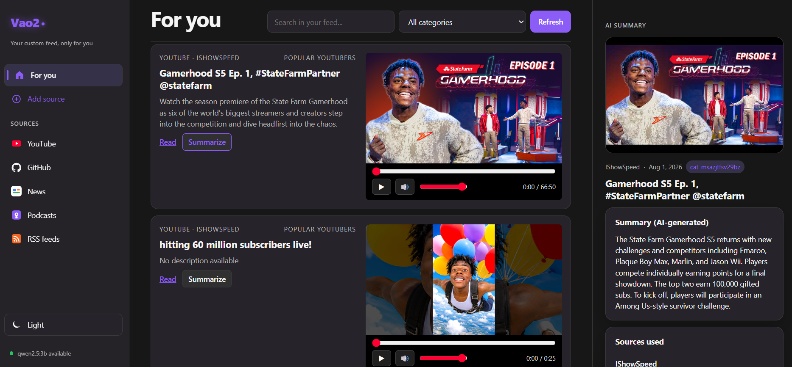

<p align="center">
  
</p>

<div align="center">

**Your personal feed for News, YouTube, GitHub and more, powered by local AI.**

[](https://www.python.org/)
[](https://fastapi.tiangolo.com/)
[](https://www.sqlite.org/)
[](https://github.com/ggml-org/llama.cpp)
[](https://developer.mozilla.org/docs/Web/JavaScript)
[](https://www.typescriptlang.org/)
</div> 

---

Vao2 brings together all the content you’re interested in in one place. Follow topics,
YouTube channels, GitHub repositories, news and other features coming soon, without having to switch between platforms,
then use the on-device AI to turn long articles and video transcripts into clear, concise summaries.
Stay informed faster.

## Preview

<p align="center">
  
</p>

## Demo

https://github.com/user-attachments/assets/4d5ebcee-5662-4bc4-b461-e677872edec3

<p align="center">
  <a href="https://github.com/Loann110/Vao2/issues/1#issuecomment-5154011207">
  </a>
</p>

## Work in progress

> Vao2 is under active development. Features and APIs may change.

Contributions, feedback and bug reports are welcome.

Vao2 will eventually be available as a dedicated Windows, macOS and Linux app. A browser
extension and a mobile app are also being considered for future releases.

## Quick start

Windows:

```bat
scripts\setup.bat
scripts\start.bat
```

macOS / Linux:

```bash
chmod +x scripts/*.sh
./scripts/setup.sh
./scripts/start.sh
```

Then open http://127.0.0.1:8000.

### Local AI model

Vao2 runs `llama.cpp` directly inside its FastAPI process; Ollama and a separate
model server are not required. Download the default Qwen GGUF after setup:

Windows:

```bat
.venv\Scripts\python.exe scripts\download_model.py
```

macOS / Linux:

```bash
.venv/bin/python scripts/download_model.py
```

The default model is stored at
`models/qwen2.5-1.5b-instruct-q4_k_m.gguf`. This 1.5B Q4 model provides a
better balance between summary quality and CPU performance. Runtime
settings can be overridden with:

- `VAO2_MODEL_PATH`: path to another GGUF model;
- `VAO2_MODEL_CONTEXT`: context size, default `1536` to balance quality and latency;
- `VAO2_MODEL_THREADS`: CPU thread count;
- `VAO2_MODEL_GPU_LAYERS`: GPU-offloaded layers, default `0` for CPU;
- `VAO2_MODEL_MAX_TOKENS`: generation limit, default `120`.

## Contributing

1. Open an issue to describe the change or bug.
2. Create a focused branch and keep the implementation small.
3. Test your changes locally.
4. Open a pull request explaining what changed.
