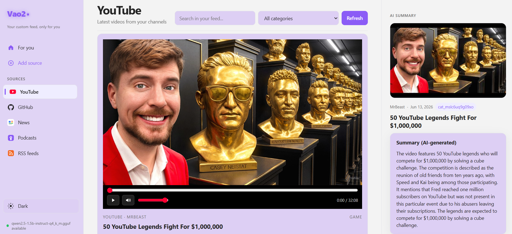
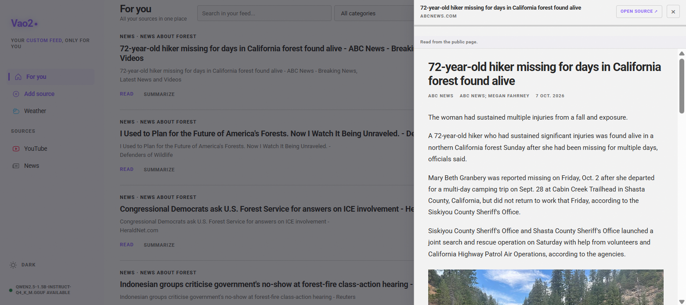
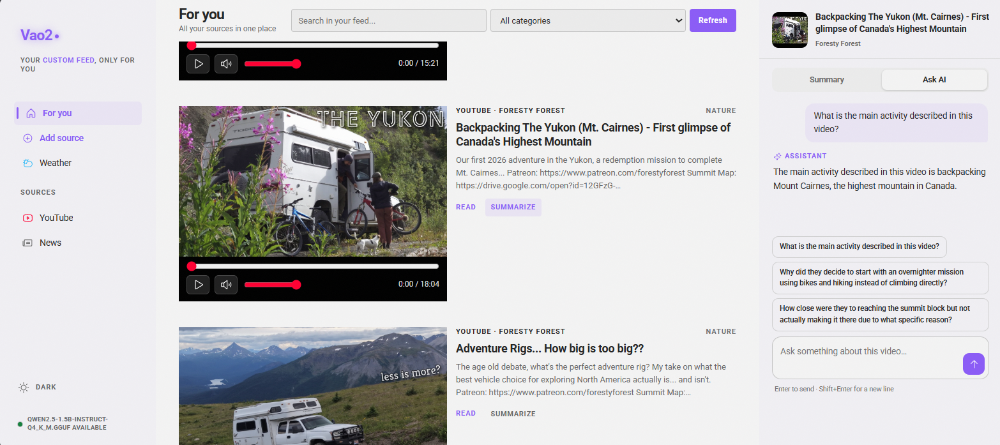
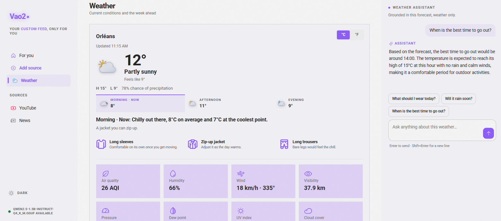
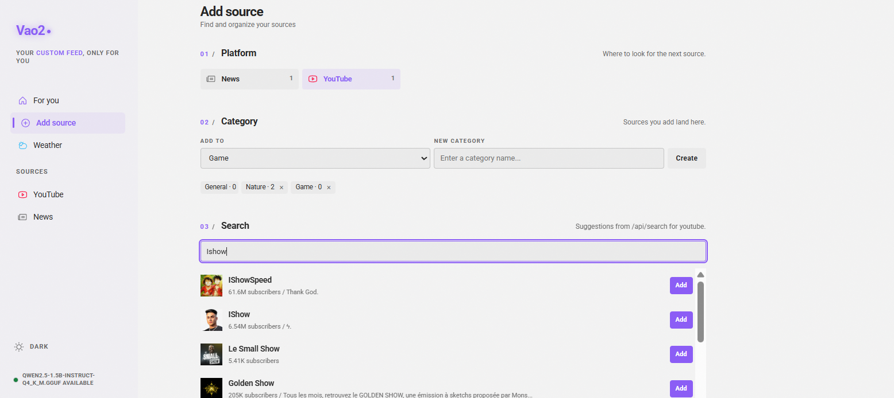
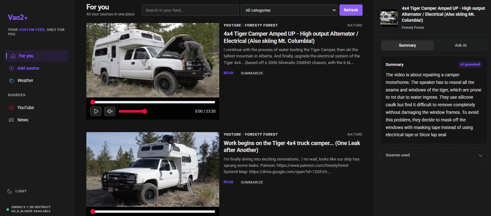
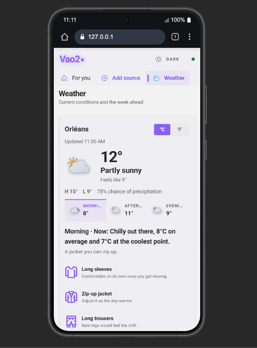

<p align="center">
  
</p>

<div align="center">

**Your personal feed for News and YouTube, powered by local AI.**

[](https://www.python.org/)
[](https://fastapi.tiangolo.com/)
[](https://www.sqlite.org/)
[](https://github.com/ggml-org/llama.cpp)
[](https://developer.mozilla.org/docs/Web/JavaScript)
</div>

---

Vao2 brings together all the content you’re interested in in one place. Follow topics,
YouTube channels and news from selected sources, without having to switch between platforms,
then use the on-device AI to turn long articles and video transcripts into clear, concise summaries.
Stay informed faster.

> [!IMPORTANT]
> **Before changing any code, read [ARCHITECTURE.md](ARCHITECTURE.md).**
> It maps every part of the interface to the file that draws it, the API route
> it calls and the logic behind it, and explains how the pieces fit together.
> Then follow [CONTRIBUTING.md](CONTRIBUTING.md) (code style) and
> [AGENTS.md](AGENTS.md) (keep it simple: no needless abstractions).

## Preview

<p align="center">
  
</p>

<table>
  <tr>
    <td></td>
    <td></td>
  </tr>
  <tr>
    <td align="center">Read articles without leaving the feed</td>
    <td align="center">Summarize and ask questions, on-device</td>
  </tr>
  <tr>
    <td></td>
    <td></td>
  </tr>
  <tr>
    <td align="center">Weather, what to wear, and a weather assistant</td>
    <td align="center">Add YouTube channels and news sites</td>
  </tr>
  <tr>
    <td></td>
    <td></td>
  </tr>
  <tr>
    <td align="center">Light and dark themes</td>
    <td align="center">Works on small screens</td>
  </tr>
</table>

## Demo

<!-- To embed a player: drag docs/demo.mp4 into a GitHub comment box and paste the user-attachments URL it gives here. -->
[▶ Watch the demo (2 min)](docs/demo.mp4): feed, YouTube player, AI summary and questions, reader, adding a source, weather and its assistant.

## Work in progress

> Vao2 is under active development. Features and APIs may change.

Contributions, feedback and bug reports are welcome.

Vao2 will eventually be available as a dedicated Windows, macOS and Linux app. A browser
extension and a mobile app are also being considered for future releases.

## Quick start

Windows:

```bat
scripts\setup.bat
scripts\start.bat
```

macOS / Linux:

```bash
chmod +x scripts/*.sh
./scripts/setup.sh
./scripts/start.sh
```

Then open http://127.0.0.1:8080.

### Local AI model

Vao2 runs `llama.cpp` directly inside its FastAPI process; Ollama and a separate
model server are not required. Download the default Qwen GGUF after setup:

Windows:

```bat
.venv\Scripts\python.exe scripts\download_model.py
```

macOS / Linux:

```bash
.venv/bin/python scripts/download_model.py
```

The default model is stored at
`models/qwen2.5-1.5b-instruct-q4_k_m.gguf`. This 1.5B Q4 model provides a
better balance between summary quality and CPU performance. Vao2 automatically selects a
compact, balanced, or performance profile from the host's CPU, memory, architecture, and
llama.cpp GPU-offload support. The detected settings are visible at `/api/llm/status`.

Automatic settings can be overridden with:

- `VAO2_MODEL_PATH`: path to another GGUF model
- `VAO2_MODEL_CONTEXT`: context size
- `VAO2_MODEL_BATCH`: prompt-processing batch size
- `VAO2_MODEL_THREADS`: CPU thread count
- `VAO2_MODEL_GPU_LAYERS`: GPU-offloaded layers (`-1` means all layers)
- `VAO2_MODEL_MAX_TOKENS`: generation limit

### YouTube videos that only play on YouTube

Some owners, often music labels, refuse playback on other sites. Vao2 shows these as a
"YouTube only" card linking to the video instead of a player that fails. The embedded
player detects them on its own and the result is saved. Set `VAO2_YOUTUBE_API_KEY` (YouTube
Data API v3) to flag new videos on refresh, before they are displayed. That costs one
quota unit per 50 videos.


## Project layout

**Start with [ARCHITECTURE.md](ARCHITECTURE.md).** It is the map of the
project: where each feature lives, from the button you see to the backend code
that answers it. Reading it first saves searching through the folders.

```text
backend/    FastAPI app: routes/, platforms/ (outside world), llm/ (local AI), db.py
frontend/   plain JavaScript modules, one folder per part of the interface
scripts/    setup, start, model and icon downloads
docs/       images and demo video
```

## Contributing

1. **Read [ARCHITECTURE.md](ARCHITECTURE.md)** to find the code you need, then
   [CONTRIBUTING.md](CONTRIBUTING.md) and [AGENTS.md](AGENTS.md) for the rules.
2. Open an issue to describe the change or bug.
3. Create a focused branch and keep the implementation small.
4. Test your changes locally.
5. Open a pull request explaining what changed.
